<div align="center">

# 🛡️ AI SOC Analyst Assistant

### Offline Phishing Triage and Retrieval-Augmented Cybersecurity Operations Platform

Built with Python • Ollama • FAISS • Streamlit • Sentence Transformers

---


---

### Local AI • Phishing Triage • RAG • SOC Analysis • No Cloud AI API Required

</div>

---

# 📖 Table of Contents

- [Project Overview](#-project-overview)
- [Air-Gap-Capable Operation](#-air-gap-capable-operation)
- [Core Capabilities](#-core-capabilities)
- [How the Platform Works](#-how-the-platform-works)
- [Project Architecture](#-project-architecture)
- [Technology Stack](#-technology-stack)
- [Cybersecurity Knowledge Base](#-cybersecurity-knowledge-base)
- [Repository Structure](#-repository-structure)
- [Installation and Launch](#-installation-and-launch)
- [Example Questions](#-example-questions)
- [Project Screenshots](#-project-screenshots)
- [Testing and Validation](#-testing-and-validation)
- [Documentation](#-documentation)
- [Skills Demonstrated](#-skills-demonstrated)
- [Future Improvements](#-future-improvements)
- [Important Limitations](#-important-limitations)
- [Author](#-author)
- [License](#-license)

---

# 🎯 Project Overview

The **AI SOC Analyst Assistant** is a local cybersecurity operations platform that combines two practical analyst workflows:

1. **Automated phishing email triage**
2. **Retrieval-Augmented Generation cybersecurity assistance**

The phishing workflow allows an analyst to paste or upload suspicious email content for structured review. The application can identify indicators, suspicious language, social-engineering characteristics, sender concerns, links, and other details that may require further investigation.

The cybersecurity knowledge assistant allows users to ask natural-language questions about threats, vulnerabilities, defensive frameworks, incident response, phishing, malware, security controls, and Security Operations Center procedures.

Before generating an answer, the assistant searches a locally stored cybersecurity knowledge base using **FAISS semantic retrieval**. Relevant document sections are then provided to a locally hosted Large Language Model through **Ollama**.

This produces responses that are more grounded, transparent, and useful than answers generated from the language model alone.

---

# 🔒 Air-Gap-Capable Operation

The platform is designed for private, restricted, disconnected, and air-gapped environments.

After the required software, Python packages, Ollama model, vector index, and cybersecurity documents have been installed locally, the application's core workflows can operate without an active internet connection.

During normal offline operation:

- Analyst questions remain on the local workstation.
- Suspicious email content remains on the local workstation.
- Cybersecurity documents are retrieved from local storage.
- Embeddings are processed locally.
- FAISS searches are performed locally.
- AI responses are generated locally through Ollama.
- No OpenAI API key is required.
- No paid cloud AI subscription is required.
- No prompts need to be transmitted to an external AI provider.

> **Important:** Internet access is required during initial provisioning to download the project, Python dependencies, Ollama, the selected language model, and any required knowledge-base documents. After those resources are stored locally, the main analysis workflows can function without external network access.

This design makes the project appropriate for:

- Cybersecurity laboratories
- SOC training environments
- Restricted networks
- Sensitive testing environments
- Privacy-focused deployments
- Offline demonstrations
- Air-gapped research systems

---

# ✨ Core Capabilities

## 🤖 Cybersecurity Knowledge Assistant

The Retrieval-Augmented Generation interface allows analysts to ask questions about:

- Security operations
- Cybersecurity threats
- Detection engineering
- Incident response
- Phishing
- Malware
- Vulnerabilities
- CVEs
- MITRE ATT&CK
- MITRE ATLAS
- MITRE D3FEND
- NIST guidance
- OWASP guidance
- Authentication security
- Password security
- Security logging
- Defensive controls

The assistant retrieves relevant information from the local knowledge base before generating a response through Ollama.

### RAG capabilities

- Natural-language cybersecurity questions
- Local document retrieval
- Semantic vector search
- Context-aware response generation
- Source-supported answers
- Similarity-ranked retrieval results
- Reduced dependence on model memory
- Reduced hallucination risk
- Local inference without cloud AI services

---

## 🎣 Automated Phishing Email Triage

The phishing workflow supports analyst review of suspicious email content.

Potential analysis areas include:

- Sender information
- Subject line
- Message body
- Suspicious URLs
- Urgent or threatening language
- Credential-harvesting indicators
- Sender impersonation
- Social-engineering techniques
- Payment or account pressure
- Suspicious attachment references
- Indicators of compromise
- Severity observations
- Recommended analyst actions

The application is intended to support human review rather than replace analyst judgment.

---

## 📚 Local Knowledge Retrieval

The application:

1. Loads trusted cybersecurity documents.
2. Extracts text from the documents.
3. Splits the text into searchable chunks.
4. Generates local vector embeddings.
5. Stores the embeddings in a FAISS index.
6. Converts a user's question into an embedding.
7. Searches for the most relevant document chunks.
8. Sends the retrieved context to Ollama.
9. Generates a grounded response.
10. Displays relevant source information.

---

## 💻 Software Engineering Features

- Modular Python architecture
- Streamlit web interface
- Local Ollama integration
- Sentence Transformer embeddings
- FAISS vector database
- PDF document processing
- Automatic text chunking
- Semantic similarity search
- Automated testing with Pytest
- Git version control
- Beginner-friendly documentation
- Rebuildable local vector store
- Expandable knowledge-base structure

---

# 🔄 How the Platform Works

The project supports two complementary analyst workflows.

## Cybersecurity question workflow

```text
Analyst Question
      │
      ▼
Streamlit Interface
      │
      ▼
RAG Engine
      │
      ▼
Sentence Transformer Embedding
      │
      ▼
FAISS Vector Search
      │
      ▼
Relevant Cybersecurity Documents
      │
      ▼
Ollama Local Language Model
      │
      ▼
Grounded Answer and Sources
```

## Phishing analysis workflow

```text
Suspicious Email
      │
      ▼
Streamlit Interface
      │
      ▼
Email Parsing and Analysis
      │
      ▼
Indicator and Pattern Review
      │
      ▼
Structured Phishing Findings
      │
      ▼
Human Analyst Decision
```

---

# 🏗 Project Architecture

```text
                             Analyst
                                │
                                ▼
                    Streamlit Web Interface
                                │
               ┌────────────────┴────────────────┐
               │                                 │
               ▼                                 ▼
   Cybersecurity Knowledge Mode         Phishing Triage Mode
               │                                 │
               ▼                                 ▼
          RAG Engine                    Email Analysis Engine
               │                                 │
       ┌───────┴────────┐                        │
       │                │                        │
       ▼                ▼                        ▼
Sentence Transformer  FAISS Search       Structured Findings
       │                │                        │
       └───────┬────────┘                        │
               ▼                                 │
     Retrieved Local Context                     │
               │                                 │
               ▼                                 │
        Ollama Local LLM                         │
               │                                 │
               └────────────────┬────────────────┘
                                ▼
                     Analyst Decision Support
```

Both workflows are designed to execute locally. The RAG workflow searches the local FAISS index before response generation, while the phishing workflow processes suspicious email content and presents structured findings for analyst review.

---

# 🛠 Technology Stack

| Category | Technology |
|---|---|
| Programming Language | Python |
| Web Interface | Streamlit |
| Local AI Runtime | Ollama |
| Large Language Model | Llama 3.2 |
| AI Architecture | Retrieval-Augmented Generation |
| Embedding Model | Sentence Transformers |
| Vector Database | FAISS |
| Document Processing | PyMuPDF |
| Testing | Pytest |
| Version Control | Git |
| Repository Hosting | GitHub |
| Development Environment | Visual Studio Code |

---

# 📚 Cybersecurity Knowledge Base

The local knowledge base includes material covering:

- MITRE ATT&CK
- MITRE ATLAS
- MITRE D3FEND
- NIST Cybersecurity Framework
- NIST security guidance
- NIST password guidance
- OWASP Top 10
- CISA phishing guidance
- High-impact CVEs
- Log4Shell and CVE-2021-44228
- Incident-response playbooks
- SOC procedures
- Authentication best practices
- Password security
- Security logging
- Phishing detection
- Threat intelligence concepts
- Defensive cybersecurity controls

## MITRE ATT&CK

MITRE ATT&CK provides structured information about adversary tactics, techniques, and procedures observed in real-world attacks.

The assistant can use indexed ATT&CK documentation to support questions about:

- Initial access
- Execution
- Persistence
- Privilege escalation
- Credential access
- Discovery
- Lateral movement
- Collection
- Command and control
- Exfiltration
- Impact

## MITRE ATLAS

MITRE ATLAS documents adversarial tactics and techniques affecting artificial-intelligence and machine-learning systems.

The assistant can answer questions involving:

- AI system threats
- Prompt injection
- Model extraction
- Data poisoning
- Adversarial machine learning
- AI-focused mitigations
- Differences between ATLAS and ATT&CK

## MITRE D3FEND

MITRE D3FEND provides a knowledge graph of defensive cybersecurity techniques.

The assistant can explain:

- Defensive countermeasures
- The relationship between ATT&CK and D3FEND
- Detection and protection concepts
- Defensive technique selection
- Cybersecurity control relationships

## NIST

The assistant can retrieve locally stored NIST material covering:

- Cybersecurity risk management
- Identify
- Protect
- Detect
- Respond
- Recover
- Govern
- Authentication
- Password guidance
- Security controls

## CVEs and Vulnerability Knowledge

The local knowledge base includes high-impact vulnerability information.

Example topics include:

- CVE identifiers
- Vulnerability impact
- Affected technologies
- Severity
- Exploitation risk
- Recommended mitigations
- Log4Shell
- CVE-2021-44228

---

# 📂 Repository Structure

```text
AI-SOC-Assistant/
│
├── backend/
│   ├── rag_engine.py
│   └── supporting backend modules
│
├── frontend/
│   ├── streamlit_app.py
│   └── supporting interface files
│
├── knowledge_base/
│   ├── documents/
│   │   ├── mitre_attack/
│   │   ├── mitre_atlas/
│   │   ├── mitre_d3fend/
│   │   ├── nist/
│   │   ├── owasp/
│   │   ├── cve/
│   │   └── additional cybersecurity documents
│   │
│   └── indexes/
│       ├── FAISS index files
│       └── document metadata
│
├── tests/
│   ├── RAG retrieval tests
│   ├── application tests
│   └── validation scripts
│
├── docs/
│   ├── Part-A-Install-and-Run.md
│   ├── Part-B-Build-From-Scratch.md
│   ├── Part-C-Testing-and-Validation.md
│   └── Part-D-GitHub-Deployment-and-Troubleshooting.md
│
├── screenshots/
│   ├── 01-main-dashboard.png
│   ├── 02-phishing-answer.png
│   ├── 03-mitre-answer.png
│   ├── 04-source-citations.png
│   ├── 05-pytest-results.png
│   ├── 06-vector-store-files.png
│   ├── 07-ollama-models.png
│   ├── 08-automated-phishing-engine-results.png
│   ├── 09-mitre-atlas.png
│   ├── 10-d3fend-related-to-mitre.png
│   ├── 11-nist-framework.png
│   └── 12-log4shell-cve.png
│
├── evaluation/
├── data/
├── app.py
├── dashboard.py
├── requirements.txt
├── README.md
└── .gitignore
```

> The exact supporting filenames may change as the project develops. Refer to the repository for the current structure.

---

# 🚀 Installation and Launch

Complete beginner installation instructions are available in:

[Part A – Install and Run the Finished Project](docs/Part-A-Install-and-Run.md)

## Quick-start overview

### 1. Clone the repository

```powershell
git clone https://github.com/ericsledge/AI-SOC-Assistant.git
cd AI-SOC-Assistant
```

### 2. Create a virtual environment

```powershell
python -m venv venv
```

### 3. Activate the virtual environment

```powershell
.\venv\Scripts\Activate.ps1
```

### 4. Install dependencies

```powershell
python -m pip install --upgrade pip
pip install -r requirements.txt
```

### 5. Confirm Ollama is installed

```powershell
ollama --version
```

### 6. Download the local model

```powershell
ollama pull llama3.2:3b
```

### 7. Confirm the model is available

```powershell
ollama list
```

### 8. Launch the cybersecurity assistant

From the project root:

```powershell
python -m streamlit run .\frontend\streamlit_app.py
```

Streamlit should open the application in a local web browser.

A typical local address is:

```text
http://localhost:8501
```

> Depending on the current interface design, phishing triage may appear as a separate page, navigation option, or application mode.

---

# 💬 Example Questions

Use the following questions to validate the local knowledge assistant.

## MITRE ATLAS

```text
What is MITRE ATLAS?
```

```text
How does MITRE ATLAS differ from MITRE ATT&CK?
```

```text
What is data poisoning?
```

```text
What is prompt injection?
```

## MITRE D3FEND

```text
What is MITRE D3FEND?
```

```text
How does MITRE D3FEND relate to MITRE ATT&CK?
```

```text
How can D3FEND support defensive cybersecurity operations?
```

## NIST

```text
What is the NIST Cybersecurity Framework?
```

```text
What are the core functions of the NIST Cybersecurity Framework?
```

```text
What password guidance does NIST provide?
```

## CVEs

```text
What is CVE-2021-44228?
```

```text
Explain Log4Shell.
```

```text
What are high-impact CVEs?
```

```text
What mitigations are associated with Log4Shell?
```

## SOC operations

```text
How should a SOC analyst investigate a phishing email?
```

```text
What indicators should an analyst review during a phishing investigation?
```

```text
What is an indicator of compromise?
```

```text
How should a security team respond to suspected credential theft?
```

## OWASP

```text
What is the OWASP Top 10?
```

```text
How can SQL injection be prevented?
```

```text
How can cross-site scripting be prevented?
```

---

# 📸 Project Screenshots

The following screenshots demonstrate the completed platform, testing process, local AI model, vector database, phishing workflow, and expanded cybersecurity knowledge base.

> If an image does not appear, confirm that the filename and extension exactly match the file stored in the `screenshots/` directory.

---

## 01 — Main Dashboard

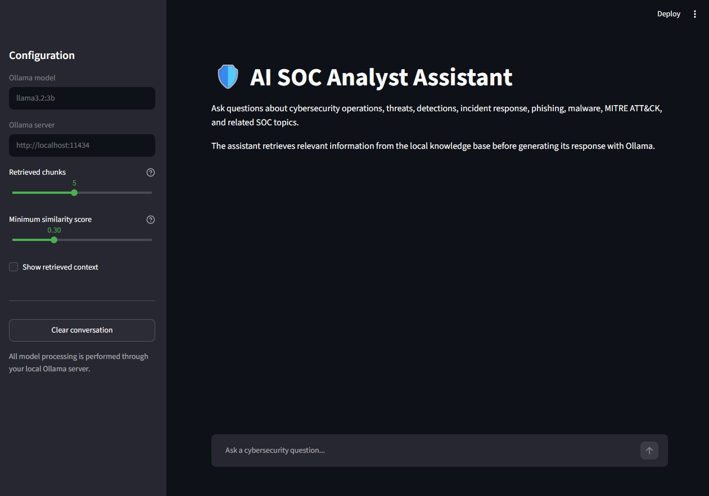

The main Streamlit interface provides access to the AI SOC Analyst Assistant through a local web application.

---

## 02 — Phishing Analysis Response

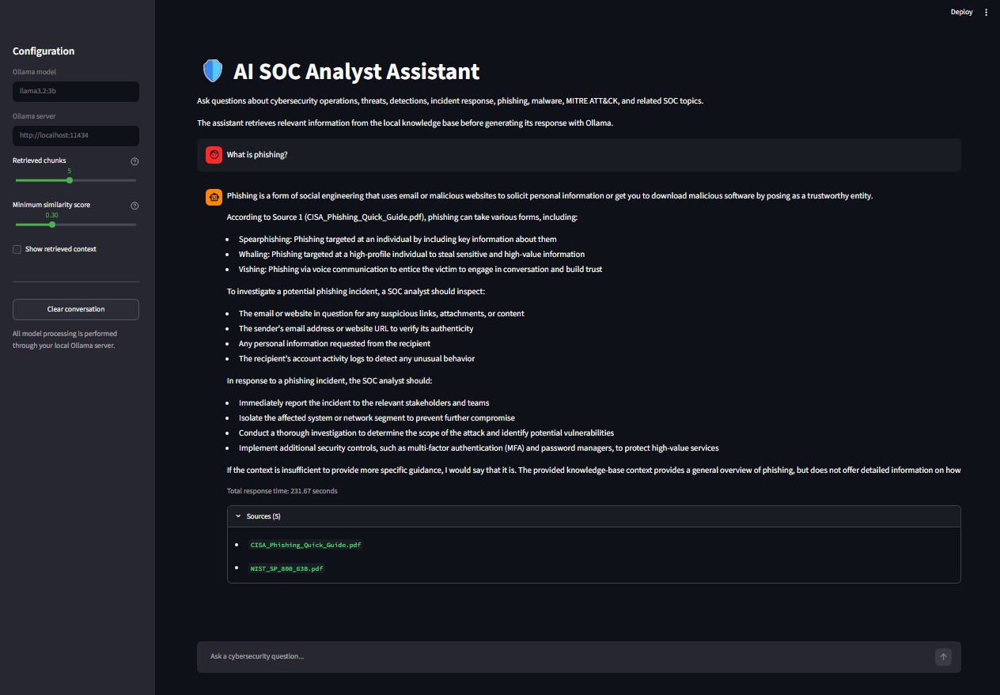

The phishing workflow reviews suspicious email content and presents analyst-oriented observations.

---

## 03 — MITRE ATT&CK Response

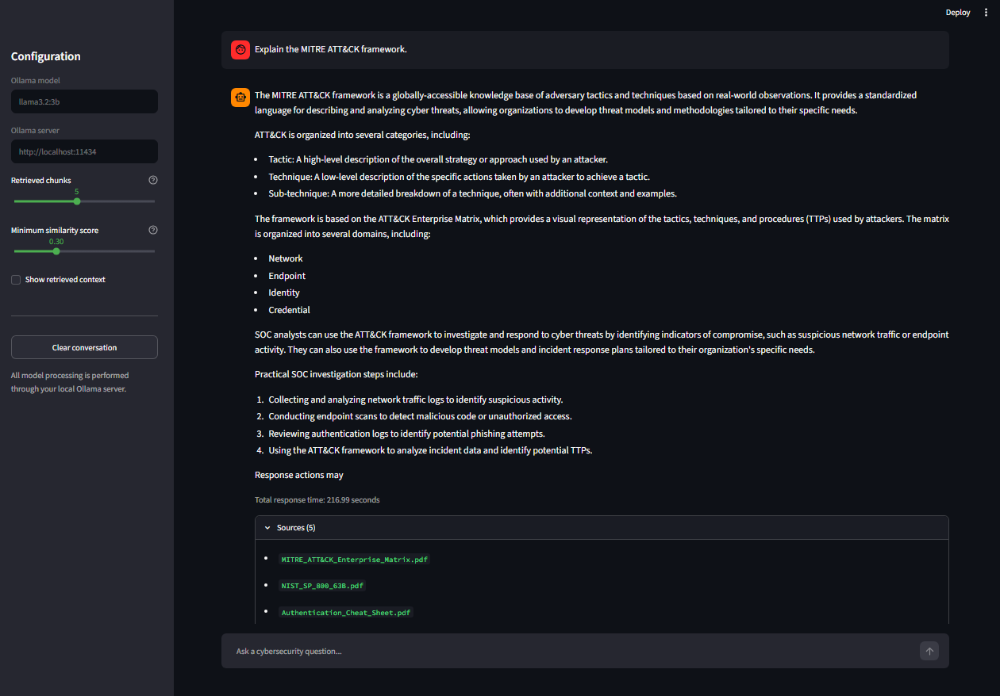

The assistant retrieves indexed MITRE documentation before generating a grounded cybersecurity response.

---

## 04 — Source Citations

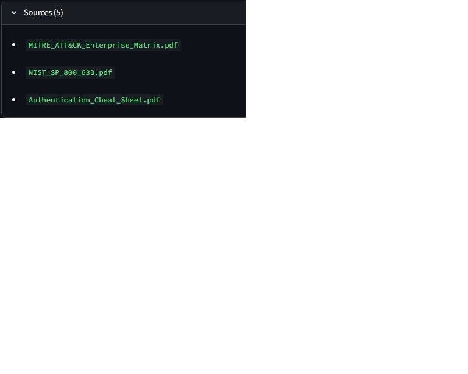

Retrieved source information allows the analyst to identify which local documents contributed to the response.

---

## 05 — Automated Pytest Results

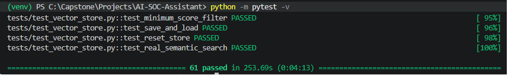

Automated testing helps validate retrieval, application behavior, and supporting project components.

---

## 06 — FAISS Vector Store


Cybersecurity document embeddings and supporting metadata are stored locally for semantic retrieval.

---

## 07 — Ollama Models Running Locally

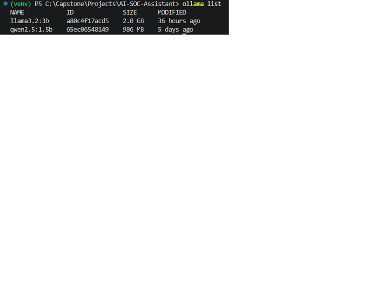

Ollama runs the selected language model directly on the local workstation without requiring a paid cloud AI API.

---

## 08 — Automated Phishing Engine Results

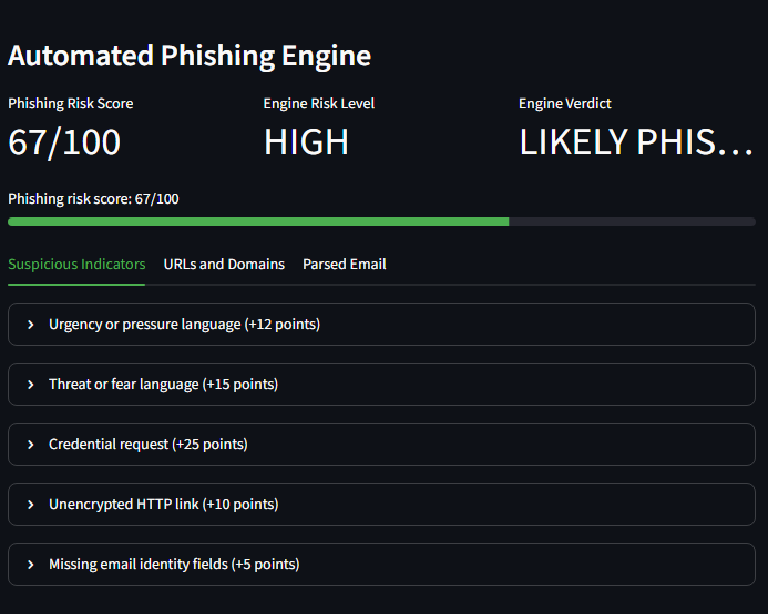

The phishing engine produces structured findings that can support analyst review of suspicious messages, indicators, links, and social-engineering characteristics.

---

## 09 — MITRE ATLAS Retrieval

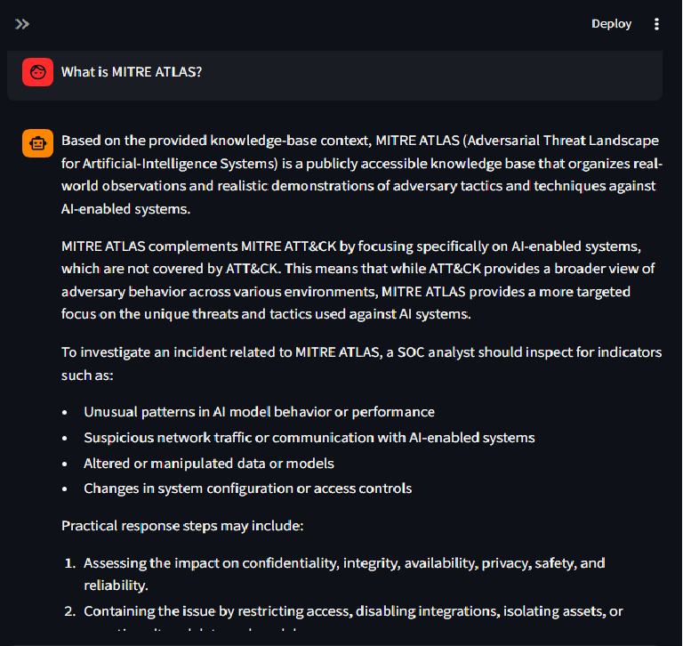

The assistant retrieves locally indexed MITRE ATLAS content to answer questions about adversarial activity affecting AI and machine-learning systems.

---

## 10 — MITRE D3FEND and ATT&CK Relationship

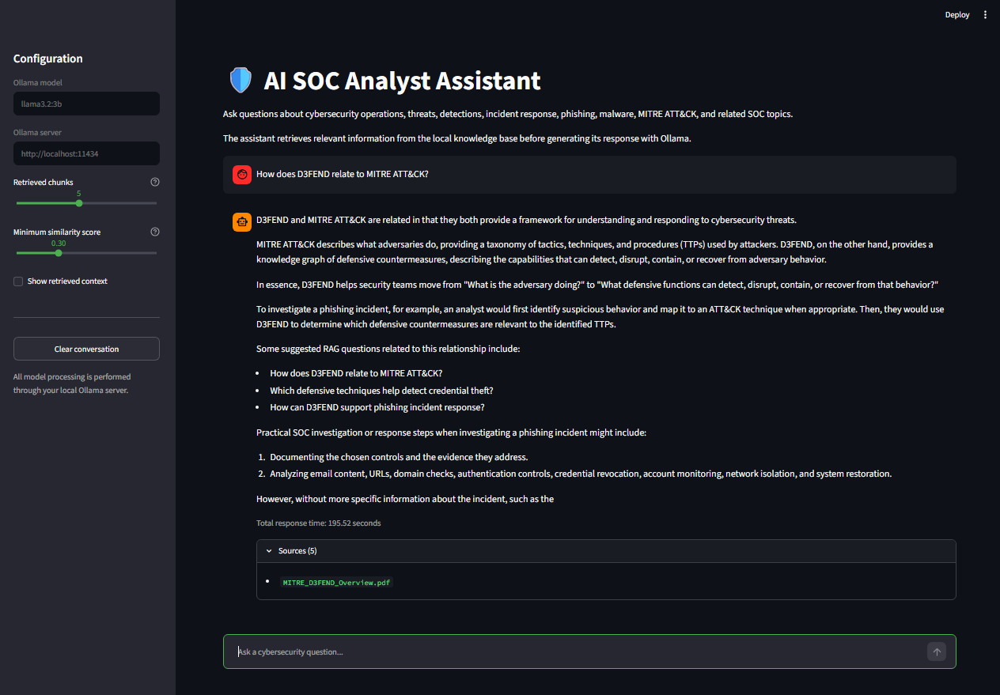

The assistant explains how MITRE D3FEND defensive techniques relate to adversary behavior documented through MITRE ATT&CK.

---

## 11 — NIST Cybersecurity Framework

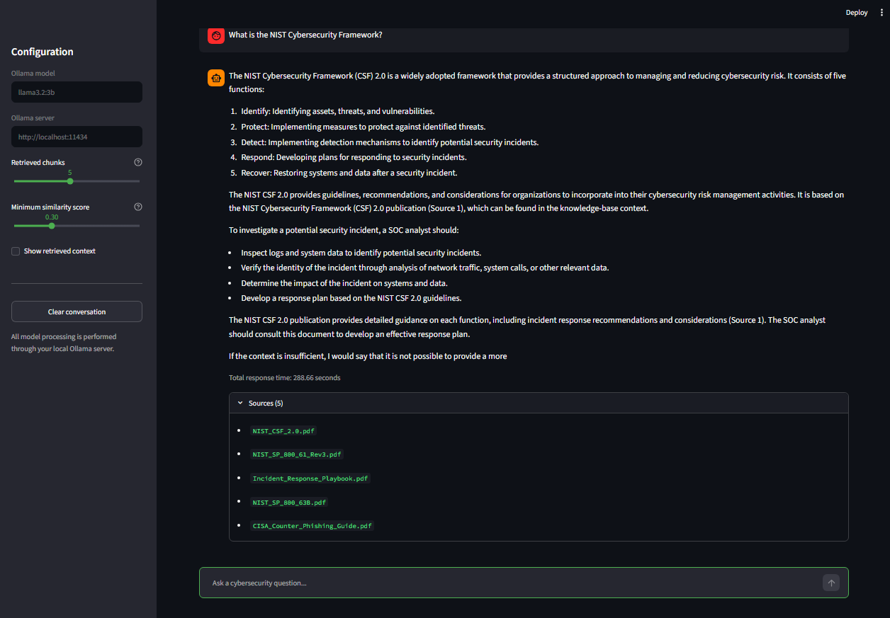

The local RAG system retrieves NIST documentation to explain cybersecurity risk-management functions and framework concepts.

---

## 12 — Log4Shell CVE Analysis

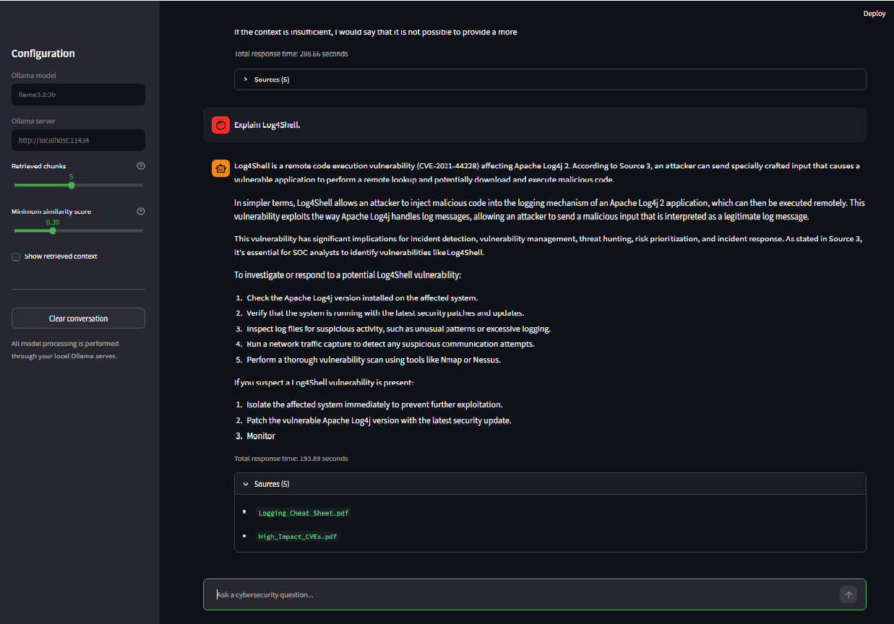

The assistant retrieves local vulnerability documentation to explain Log4Shell, CVE-2021-44228, potential impact, and mitigation considerations.

---

# 🧪 Testing and Validation

The project includes automated and manual testing.

## Automated tests

Run the test suite from the project root:

```powershell
pytest
```

For more detailed output:

```powershell
pytest -v
```

## RAG verification

The following areas should be validated:

| Test Area | Example Question | Expected Source Type |
|---|---|---|
| MITRE ATT&CK | What is MITRE ATT&CK? | MITRE ATT&CK documentation |
| MITRE ATLAS | What is MITRE ATLAS? | MITRE ATLAS overview |
| MITRE D3FEND | How does D3FEND relate to ATT&CK? | MITRE D3FEND overview |
| NIST | What is the NIST Cybersecurity Framework? | NIST documentation |
| CVE | What is CVE-2021-44228? | High-impact CVE documentation |
| Log4Shell | Explain Log4Shell. | CVE or Log4Shell documentation |
| Phishing | Analyze a suspicious email. | Structured phishing findings |

For each RAG question, confirm that:

- A relevant response is generated.
- Relevant document chunks are retrieved.
- The expected source appears.
- The application does not require a cloud AI API.
- The local model is responding through Ollama.

## Offline operational test

After all resources are installed:

1. Confirm the Ollama model is stored locally.
2. Confirm the FAISS index is present.
3. Confirm the knowledge-base documents are present.
4. Launch and test the application while connected.
5. Disconnect the workstation from the internet.
6. Restart or refresh the local application.
7. Ask an ATLAS, D3FEND, NIST, or CVE question.
8. Submit a phishing email for analysis.
9. Confirm that both local workflows continue to function.

This validates air-gap-capable operation after initial provisioning.

---

# 📘 Documentation

The repository contains a complete beginner-friendly documentation series.

## Part A — Install and Run

[Part A – Install and Run the Finished Project](docs/Part-A-Install-and-Run.md)

Covers:

- Required software
- System requirements
- Git installation
- Python installation
- Visual Studio Code installation
- Ollama installation
- Repository cloning
- Virtual environments
- Dependency installation
- Model download
- Application launch
- Initial verification

## Part B — Build from Scratch

[Part B – Build the Entire Project from Scratch](docs/Part-B-Build-From-Scratch.md)

Covers:

- Repository organization
- Python modules
- Document loading
- Text chunking
- Embeddings
- FAISS
- RAG engine development
- Ollama integration
- Streamlit development
- Phishing analysis
- Knowledge-base expansion

## Part C — Testing and Validation

[Part C – Testing and Validation](docs/Part-C-Testing-and-Validation.md)

Covers:

- Automated testing
- Retrieval testing
- Source validation
- ATLAS validation
- D3FEND validation
- NIST validation
- CVE validation
- Phishing workflow validation
- Offline operational testing

## Part D — GitHub Deployment and Troubleshooting

[Part D – GitHub Deployment, Troubleshooting, and Final Submission](docs/Part-D-GitHub-Deployment-and-Troubleshooting.md)

Covers:

- Git status
- Staging changes
- Commits
- GitHub pushes
- README verification
- Screenshot verification
- Common errors
- Troubleshooting
- Final repository review

---

# 🎓 Learning Outcomes

This project demonstrates how to:

- Build a local AI application.
- Implement Retrieval-Augmented Generation.
- Generate document embeddings.
- Store and search vectors with FAISS.
- Connect a local language model through Ollama.
- Build a Streamlit web interface.
- Process cybersecurity PDF documents.
- Expand a knowledge base without changing the RAG architecture.
- Perform local phishing email triage.
- Validate source retrieval.
- Test an AI-assisted cybersecurity application.
- Document a full capstone project.
- Use Git and GitHub for version control.
- Prepare a system for restricted or disconnected operation.

---

# 🏆 Skills Demonstrated

## Artificial Intelligence

- Local Large Language Models
- Retrieval-Augmented Generation
- Prompt engineering
- Embedding generation
- Semantic search
- Context retrieval
- Response grounding
- Local inference

## Cybersecurity

- Security Operations Center workflows
- Phishing analysis
- Incident response
- Threat intelligence
- Indicators of compromise
- MITRE ATT&CK
- MITRE ATLAS
- MITRE D3FEND
- NIST Cybersecurity Framework
- OWASP
- Vulnerability analysis
- CVE interpretation
- Log4Shell analysis

## Software Engineering

- Python development
- Modular architecture
- Streamlit
- FAISS
- PyMuPDF
- Pytest
- Virtual environments
- Dependency management
- Error handling
- Debugging
- Git
- GitHub
- Technical documentation

## Operational Design

- Local-first processing
- Air-gap-capable operation
- Data privacy
- Restricted-network deployment
- Human-in-the-loop analyst support
- Expandable knowledge-base design

---

# 🌟 What Makes This Project Different?

Many AI chatbot projects depend entirely on cloud-hosted models and the model's internal training data.

The AI SOC Analyst Assistant takes a different approach.

It combines:

- Local language-model inference
- Local cybersecurity documents
- Local semantic vector search
- Source-supported RAG responses
- Automated phishing triage
- Cybersecurity framework retrieval
- CVE knowledge
- Offline operational capability
- Human analyst review

The result is a practical educational platform that demonstrates how AI can support security operations without requiring sensitive information to be sent to an external AI service during normal operation.

---

# 🚀 Future Improvements

Potential future enhancements include:

- Unified Streamlit navigation for both application modes
- Additional MITRE ATLAS techniques
- Expanded MITRE D3FEND mappings
- Additional CVE collections
- Automated document ingestion
- Conversation memory
- Analyst case notes
- Exportable PDF reports
- IOC export
- YARA rule assistance
- Sigma rule assistance
- SIEM integration
- Local threat-intelligence feeds
- Advanced email-header parsing
- Attachment metadata analysis
- Role-based access controls
- Model selection controls
- Performance monitoring
- Improved retrieval evaluation
- Additional local language models
- Containerized offline deployment

Any future internet-based integrations should remain optional so the core local and air-gap-capable workflows continue to function independently.

---

# ⚠️ Important Limitations

This application is an educational and analyst-support project.

It should not be treated as:

- A replacement for trained security analysts
- A final authority on whether an email is malicious
- A complete malware-analysis platform
- A production SIEM
- A replacement for enterprise threat-intelligence systems
- A substitute for organizational incident-response procedures
- A source of guaranteed vulnerability remediation advice

AI-generated results and automated findings should be reviewed by a qualified human analyst.

The quality of RAG responses also depends on:

- The quality of the indexed documents
- The relevance of retrieved chunks
- The selected embedding model
- The selected Ollama model
- The wording of the question
- The configuration of the retrieval process

---

# ❓ Frequently Asked Questions

## Does this project require an OpenAI API key?

No.

The application uses Ollama for local language-model inference.

## Does this project require a paid AI subscription?

No.

The selected model runs locally after it has been downloaded.

## Can the application run without internet access?

Yes, after initial provisioning.

Python dependencies, Ollama, the language model, project files, and knowledge-base documents must first be downloaded and installed. After those resources are stored locally, the main RAG and phishing-analysis workflows can operate without an external internet connection.

## Is the project suitable for an air-gapped environment?

The project is designed to be air-gap-capable after all required software, models, dependencies, indexes, and documents have been transferred to and installed on the disconnected system.

## Does the assistant search the internet for answers?

The core RAG workflow searches the local FAISS knowledge base rather than the public internet.

## Can additional documents be added?

Yes.

The knowledge base can be expanded with additional trusted documents. The vector store must be rebuilt so the new documents are embedded and indexed.

## Is the phishing result a final security decision?

No.

The phishing workflow supports analyst review. Human validation is still required.

## Can another Ollama model be used?

Yes, although model configuration and system-resource requirements may need to be adjusted.

---

# 🤝 Contributing

Constructive feedback, testing, documentation improvements, and feature suggestions are welcome.

A typical contribution workflow is:

1. Fork the repository.
2. Create a new branch.
3. Make and test the changes.
4. Commit the changes.
5. Push the branch.
6. Open a pull request.

---

# 🙏 Acknowledgments

This project uses tools and knowledge made available by the open-source and cybersecurity communities.

Special acknowledgment goes to:

- Python
- Ollama
- Streamlit
- FAISS
- Sentence Transformers
- PyMuPDF
- Hugging Face
- Pytest
- Git
- GitHub
- MITRE
- NIST
- OWASP
- CISA

---

# 👨‍💻 Author

## Eric Sledge

**Artificial Intelligence • Cybersecurity • Python Development**

GitHub:

https://github.com/ericsledge

Repository:

https://github.com/ericsledge/AI-SOC-Assistant

---

# 📄 License

This repository is provided for educational, portfolio, and cybersecurity-learning purposes.

Review the repository's license file for the complete terms governing use, modification, and redistribution.

---

<div align="center">

# ⭐ AI SOC Analyst Assistant

### Local AI • Grounded Cybersecurity Retrieval • Phishing Triage • Air-Gap-Capable Operation

If this project helped you learn about artificial intelligence, cybersecurity, Python, Streamlit, FAISS, Ollama, or Retrieval-Augmented Generation, consider giving the repository a star.

**Keep Learning • Keep Building • Keep Defending**

</div>